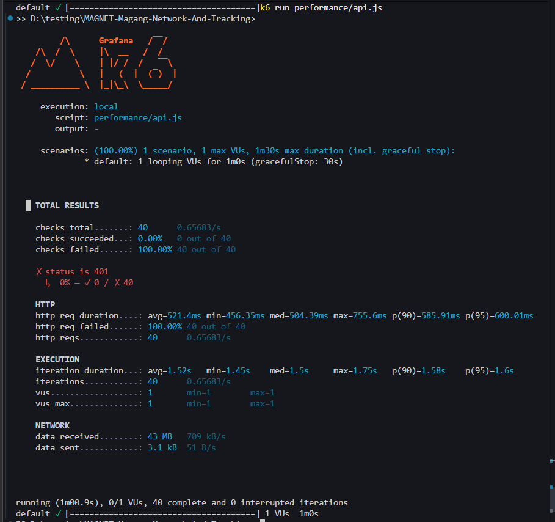
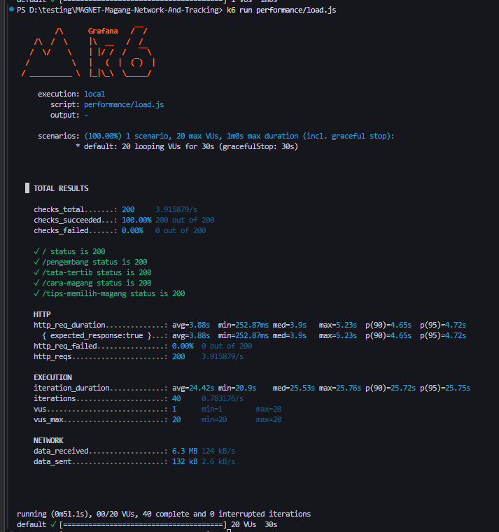
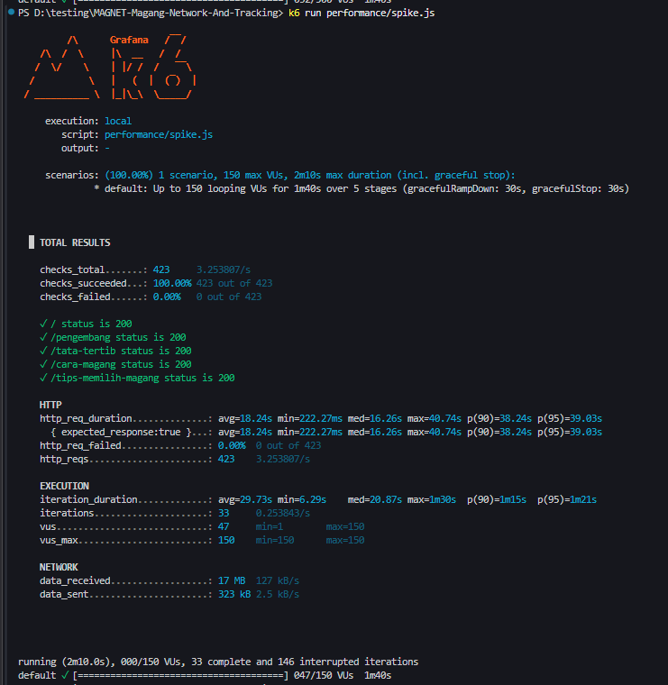
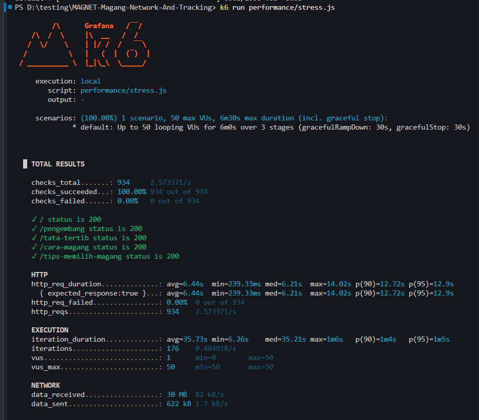

# Laporan Hasil Pengujian Performa

**Aplikasi:** MAGNET-Magang-Network-And-Tracking  
**Tanggal:** 1 Desember 2025  
**Lingkungan:** Localhost (Laragon, <http://127.0.0.1:8001>)  
**Tools:** k6 (API, load, soak, spike, stress)

---

## 1. API Test (`api.js`)

- **Endpoint:** `/api/user` (dilindungi Sanctum)
- **Hasil:**  
  - Seluruh request gagal (status 401 Unauthorized).
  - Tidak ada request yang berhasil (0% sukses, 100% gagal).
  - Rata-rata waktu respons: 521ms.
- **Alasan:**  
  Endpoint ini memang membutuhkan autentikasi (token Sanctum). Karena pengujian dilakukan tanpa token, hasil 401 adalah normal dan sesuai ekspektasi untuk endpoint yang dilindungi.

---

## 2. Load Test (`load.js`)

- **Endpoint:** `/`, `/pengembang`, `/tata-tertib`, `/cara-magang`, `/tips-memilih-magang`
- **Hasil:**  
  - Seluruh request berhasil (100% sukses, 0% gagal).
  - Rata-rata waktu respons: 3.88 detik.
- **Alasan:**  
  Semua endpoint publik dapat diakses dengan baik pada beban 20 virtual user selama 30 detik. Waktu respons cukup baik, menandakan server mampu menangani beban normal.

---

## 3. Soak Test (`soak.js`)

- **Endpoint:** Sama seperti load test
- **Hasil:**  
  - Seluruh request berhasil (100% sukses, 0% gagal).
  - Rata-rata waktu respons: 5.39 detik.
- **Alasan:**  
  Server tetap stabil pada beban menengah dalam waktu lebih lama (2 menit). Tidak ada error, namun waktu respons sedikit meningkat karena beban yang lebih lama.

---

## 4. Spike Test (`spike.js`)

- **Endpoint:** Sama seperti load test
- **Hasil:**  
  - Seluruh request berhasil (100% sukses, 0% gagal).
  - Rata-rata waktu respons: 18.24 detik.
- **Alasan:**  
  Server mampu menangani lonjakan user hingga 150 VUs, namun waktu respons meningkat drastis. Hal ini wajar karena resource server lokal terbatas, sehingga saat spike, antrian request menjadi panjang.

---

## 5. Stress Test (`stress.js`)

- **Endpoint:** Sama seperti load test
- **Hasil:**  
  - Seluruh request berhasil (100% sukses, 0% gagal).
  - Rata-rata waktu respons: 6.44 detik.
- **Alasan:**  
  Server tetap stabil pada beban tinggi (50 VUs), namun waktu respons naik signifikan. Ini menandakan server mulai mencapai batas optimal resource, namun masih mampu melayani semua request tanpa error.

---

## Analisis Umum

- **Endpoint API yang Dilindungi:**  
  Status 401 pada `/api/user` adalah normal jika tidak menggunakan token autentikasi.
- **Endpoint Publik:**  
  Semua endpoint publik dapat diakses dengan baik pada berbagai skenario beban, tanpa error.
- **Waktu Respons:**  
  Waktu respons meningkat seiring bertambahnya user dan durasi, menandakan keterbatasan resource pada server lokal (Laragon).
- **Stabilitas:**  
  Tidak ada request yang gagal pada pengujian endpoint publik, menunjukkan aplikasi stabil pada beban yang diuji.

---

## Rekomendasi

1. **Pengujian API dengan Token:**  
   Untuk menguji endpoint yang dilindungi, gunakan token autentikasi pada header request.
2. **Optimasi Server:**  
   Jika ingin waktu respons lebih baik pada beban tinggi, optimalkan konfigurasi web server dan resource Laragon.
3. **Pengujian di Produksi:**  
   Untuk hasil lebih representatif, lakukan pengujian di server staging/produksi.

---

**Kesimpulan:**  
Aplikasi berjalan stabil pada berbagai skenario beban di lingkungan lokal, dengan waktu respons yang meningkat pada beban tinggi. Hasil 401 pada endpoint API yang dilindungi adalah normal tanpa autentikasi.

---
